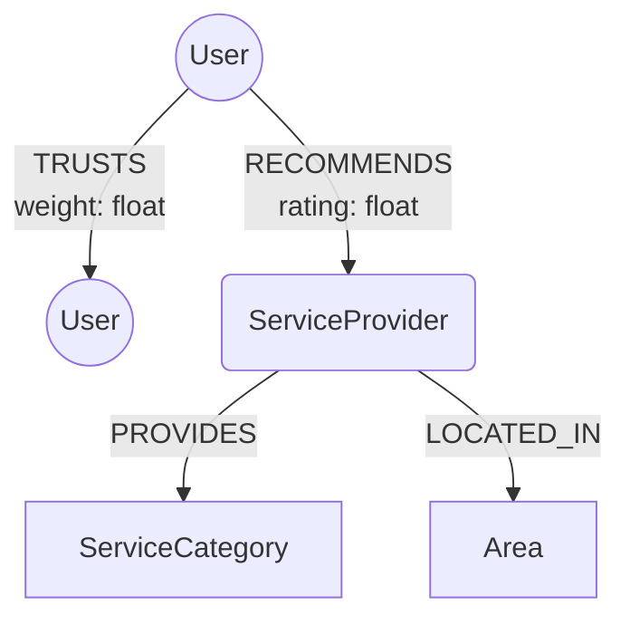

# Circle — recommendations from people you actually trust

Circle is a small graph-native application: instead of anonymous star ratings,
it ranks local service providers (plumbers, electricians, dentists, tutors...)
by how *your own trust network* — direct connections, and friends-of-friends
up to three hops out — has actually rated them. The further someone is from
you in your trust graph, the less their opinion counts, automatically.

**Live demo:** `<https://circle-app-4qhn.onrender.com/>`


---

## Why a graph database?

The core question this app answers is: *"who, at an unknown distance in my
trust network, has an opinion on this provider — and how much should that
opinion count given how far away they are?"* That's fundamentally a
variable-depth traversal with a distance-weighted aggregation on top, and it
is the kind of query that changes character entirely depending on the data
model underneath it.

**In a relational schema**, `users`, `trusts(truster_id, trustee_id, weight)`,
and `recommendations(user_id, provider_id, rating)` are enough to express the
data, but not to *query* it cleanly. Because the useful recommendation could
be 1, 2, or 3 hops away, you either hand-write a separate join for every hop
depth you want to support, or reach for a recursive CTE — which then forces
you to explicitly track path length, explicitly guard against cycles (trust
graphs have them: A trusts B, B trusts C, C trusts A closes a loop), and bolt
a hop-weighted aggregation on top with a window function. Three concerns
tangled into one query, and every added hop of "how far should we search"
makes it worse.

**In Cypher**, the same thing is a single readable pattern:

```cypher
MATCH p = (me:User {id:$userId})-[:TRUSTS*1..3]->(friend:User)
WITH friend, min(length(p)) AS hops
MATCH (friend)-[r:RECOMMENDS]->(sp:ServiceProvider)-[:PROVIDES]->(:ServiceCategory {name:$category})
RETURN sp.name AS provider,
       sum(r.rating * (1.0/hops)) / sum(1.0/hops) AS weightedScore,
       count(r) AS voices
ORDER BY weightedScore DESC
```

The deeper reason this isn't just "nicer syntax": relational databases
reconstruct a relationship at query time by taking a foreign key to an index
and looking up matching rows — a real cost, paid again at every hop, with the
candidate set fanning out multiplicatively as hop depth grows. Native graph
engines (and CognoDB, since it speaks the same Bolt/Cypher protocol) are built
around **index-free adjacency**: each node's record physically stores
pointers to its own relationships, so walking from one node to the next is a
pointer traversal, not a fresh index lookup. Cost stays proportional to the
edges actually touched rather than degrading as hop depth increases. (Worth
noting honestly: CognoDB is a managed service and its internal storage engine
isn't something I've verified directly — this is the design principle native
graph engines are built around, not a confirmed claim about CognoDB's
internals specifically.)

One modeling decision worth calling out on its own: `TRUSTS` is **directed**,
not symmetric. Trust isn't mutual by default — you can find someone's
judgment credible without them ever having an opinion of you — and modeling
it as an undirected edge would silently average away that asymmetry. This
mirrors the same distinction between follow graphs (directed, no consent
required) and old-style friend graphs (undirected, because mutual acceptance
was baked into how the relationship formed).

---

## Data model



**Nodes**
| Label | Properties |
|---|---|
| `User` | `id`, `name` |
| `ServiceProvider` | `id`, `name` |
| `ServiceCategory` | `name` (e.g. "Plumber", "Electrician") |
| `Area` | `name` (e.g. "Hanamkonda") |

**Relationships**
| Type | Direction | Properties | Meaning |
|---|---|---|---|
| `TRUSTS` | `User → User`, directed | `weight` (0–1) | "I find this person's judgment credible, to this degree." |
| `RECOMMENDS` | `User → ServiceProvider` | `rating` (1–5) | A specific person's experience with a specific provider. |
| `PROVIDES` | `ServiceProvider → ServiceCategory` | — | What kind of service this provider offers. |
| `LOCATED_IN` | `ServiceProvider → Area` | — | Where this provider operates. |

**Why `Address`/category/area are separate nodes and not string properties on
`ServiceProvider`:** the entire multi-hop search depends on being able to
traverse *through* shared entities, not just filter on flat strings. A node
is the right call whenever something needs to be traversed to, filtered on
independently, or connected from multiple other things — a category is
connected from many providers, an area could plausibly be connected from
multiple providers a person operates across, and neither is purely
descriptive of one single entity.

---

## Setup and run

### 1. Provision CognoDB
1. Sign up at [console.cognodb.com/signup](https://console.cognodb.com/signup) — no credit card required for the free tier.
2. Create a free (`c0`) instance, pick a region. Provisions in under a minute.
3. Copy the generated `bolt+s://...` URI and the password for user `cognodb` — the password is shown **exactly once**.

### 2. Configure environment
```bash
cp .env.example .env
# fill in COGNODB_URI, COGNODB_USER=cognodb, COGNODB_PASSWORD
```

### 3. Seed the graph
```bash
go mod tidy
go run ./cmd/seed
```
Idempotent — safe to re-run. Creates 10 demo users in a small trust network,
10 service providers across 8 categories and 3 areas, baseline
recommendations, and a few deliberately planted multi-hop scenarios so the
traversal has something real to demonstrate.

### 4. Build and run
```bash
cd web && npm install && npm run build && cd ..
go run ./cmd/server
```
Visit `http://localhost:8080`. The Go server serves both the API and the
built frontend from a single process.

### 5. Health check
```bash
curl localhost:8080/healthz
```
Returns `{"status":"healthy"}` only if the server can actually reach
CognoDB — not just that the process is running.

---

## The main queries, explained

**Trust-weighted category search** (`internal/provider/repo.go`,
`Search`) — the headline query. Walks up to 3 hops out through `TRUSTS`,
collapses each reachable person to their *shortest* distance from the
searching user (so someone reachable by both a 2-hop and 3-hop route is only
counted once, at 2 hops), then ranks providers by a hop-decayed weighted
average of their recommendations: a direct friend's rating counts roughly 3x
more than a 3-hop stranger's.

**Shortest trust path** (`internal/user/repo.go`, `TrustPath`) — used by
the "how you got here" UI. `shortestPath((me)-[:TRUSTS*..4]->(recommender))`
returns the actual chain of people connecting you to whoever recommended a
provider, rendered as a graph in the frontend so a user can see *why* a
result is trustworthy, not just trust a number.

**Multi-hop traversal, satisfying the assignment's requirement directly:**
both queries above traverse `[:TRUSTS*1..3]` or `[:TRUSTS*..4]` — variable-
length paths of 2+ hops.

**The query a relational database would find genuinely awkward:** the
trust-weighted search above — see the "Why a graph database?" section for
the full comparison against the equivalent recursive CTE.

---

## Architecture

```
cmd/
  server/     — HTTP entrypoint: config → driver → services → handlers → routes
  seed/       — idempotent demo data generator
internal/
  config/     — env var loading
  db/         — CognoDB driver lifecycle + health check
  trust/      — TRUSTS edges: repo → service → handler, one package per domain
  provider/   — ServiceProvider, search, RECOMMENDS edges
  user/       — user listing, trust-path lookup
web/          — React + Vite frontend, D3 for the force-directed graph views
```

Each domain package (`trust`, `provider`, `user`) follows the same internal
shape: `repo.go` (raw parameterized Cypher only), `service.go` (validation
and business rules — e.g. a user can't trust themselves), `handler.go` (HTTP
parsing/status codes only). Only exported types cross package boundaries;
the Cypher-executing layer is structurally unreachable from outside its
domain, enforced by Go's package visibility rather than convention.

**Connection details** are read exclusively from environment variables
(`internal/config`), never committed — `.env` is gitignored, `.env.example`
documents the shape.

**Error handling:** the driver's connectivity is verified once at startup
(fails fast and loudly if CognoDB is unreachable) and re-checked on every
`/healthz` call with a short timeout, so a flaky free-tier instance surfaces
as a clean "unhealthy" response rather than a hung request. The frontend
renders explicit loading, empty, and error states for every data-fetching
view rather than assuming success.

---

## UI

- **Login** — pick a demo user (no real auth; see Known Limitations)
- **Trust circle** — force-directed graph (D3) of who you trust; drag nodes,
  click a node to adjust or remove trust weight
- **Search** — category + optional area filter, ranked by trust-weighted score
- **"How you got here"** — renders the actual multi-hop trust chain(s)
  connecting you to each recommender, merged into one graph per provider
- **Recommend** — rate a provider 1–5, creates or updates your `RECOMMENDS` edge

*(add screenshots here before submitting)*

---

## Known limitations — honest scoping notes

- **Login is a demo picker, not real auth.** Building real auth wasn't worth
  the time relative to the graph-modeling work this assignment is actually
  evaluating; a real version would add invite-links or contact-sync to
  bootstrap the trust graph organically.
- **`TRUSTS` edges at `weight: 0` are excluded from ranking math but not yet
  filtered out of traversal itself** — a zero-trust connection is still
  walked during the 3-hop search, it just doesn't influence the weighted
  score. A stricter version would add a `WHERE ALL(r IN relationships(path)
  WHERE r.weight > 0)` filter.
- **"How you got here" makes one path query per recommender**, sequentially.
  Fine at this data scale; a production version would batch this into a
  single Cypher query returning multiple paths at once.
- **Popularity-based search-anchoring (reverse vs. forward traversal)** was
  designed but deliberately not built — at this dataset's size the
  performance difference is effectively zero, so the hours went into the
  parts that actually show up in the demo.
- **Recommend's create-vs-update distinction isn't reflected in the HTTP
  status code** — both currently return `201`, even though an update is
  happening server-side under the hood when a recommendation already exists.